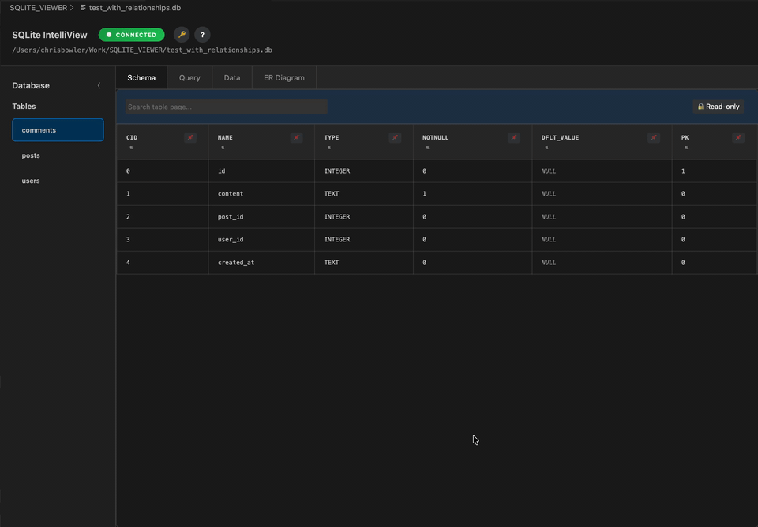
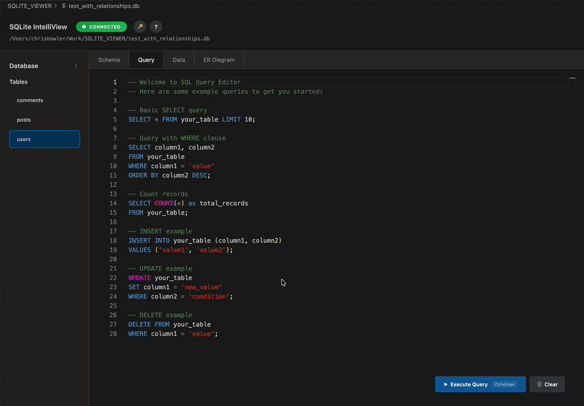
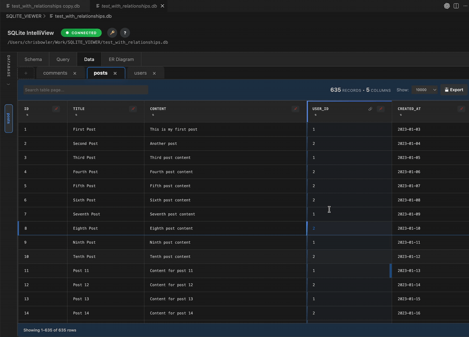
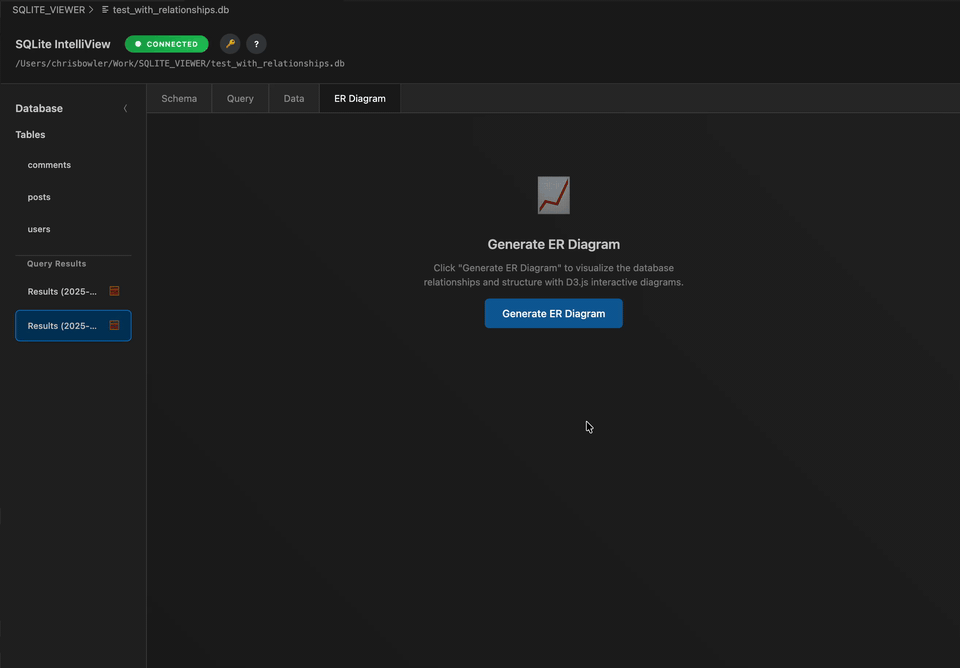
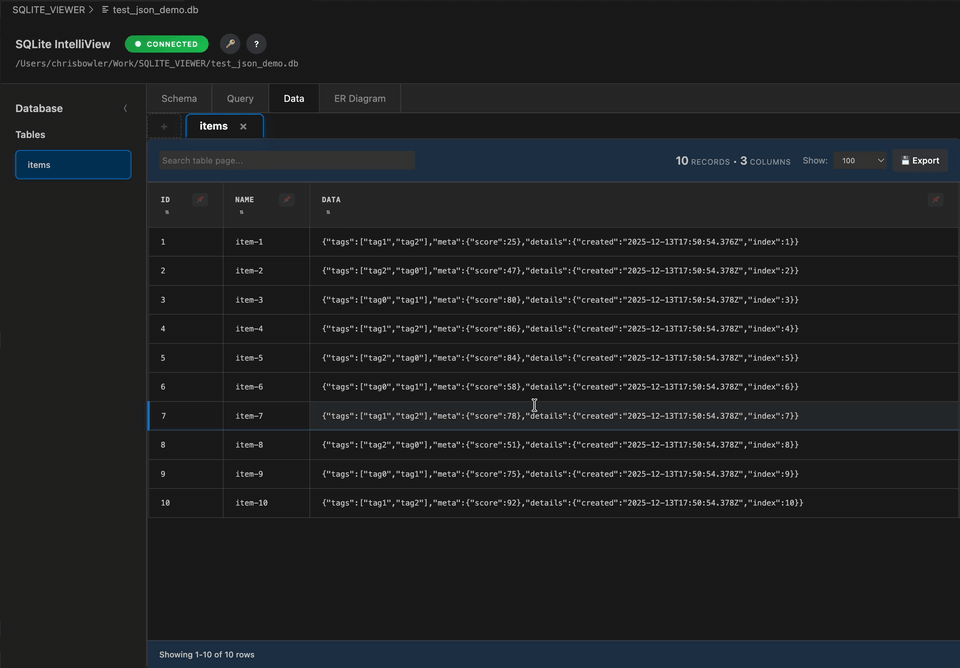
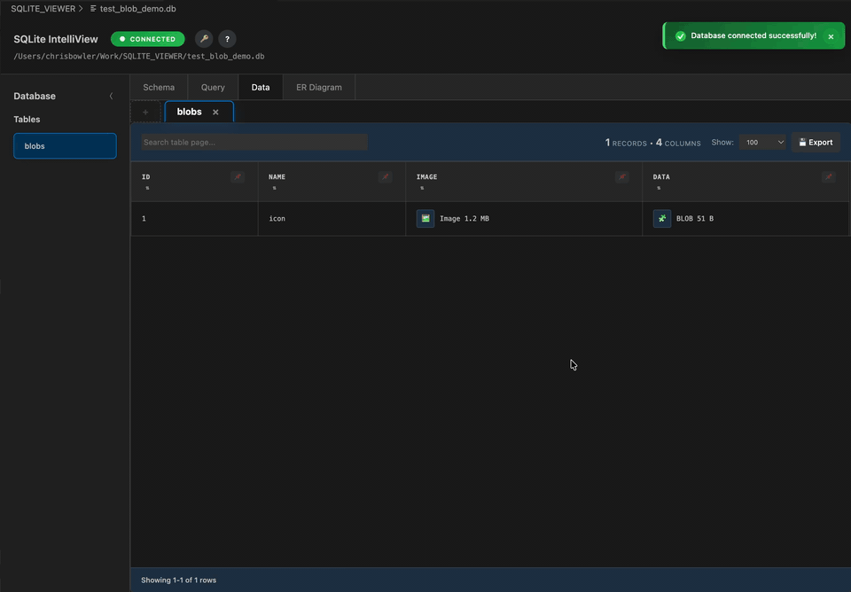
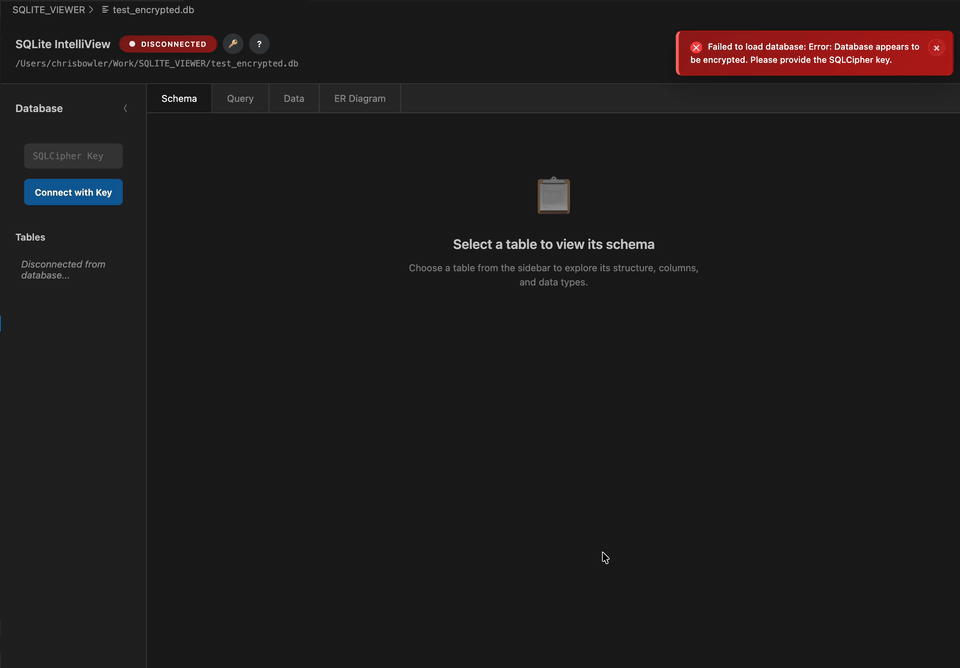

# SQLite IntelliView (Beta)

Modern SQLite (and SQLCipher) database viewer/editor for VS Code: table browsing, Monaco-powered queries, ER diagrams, and quality-of-life tooling for JSON/BLOBs and large tables.

> Beta note: features and stability are evolving. Please report issues/feedback on GitHub.

**Offline + Secure**: runs locally inside VS Code and the extension does not send your database contents anywhere (no cloud, no telemetry).

## GIF Demos

A quick tour of the main workflows (all offline, inside VS Code):

<table>
  <tr>
    <td width="50%" valign="top">
      <strong>Browse + edit tables</strong> 
      
    </td>
    <td width="50%" valign="top">
      <strong>Multi-table tabs</strong> 
      
    </td>
  </tr>
  <tr>
    <td width="50%" valign="top">
      <strong>Schema view</strong> 
      
    </td>
    <td width="50%" valign="top">
      <strong>Query editor (Monaco)</strong> 
      
    </td>
  </tr>
  <tr>
    <td width="50%" valign="top">
      <strong>Foreign-key navigation</strong> 
      
    </td>
    <td width="50%" valign="top">
      <strong>ER diagram</strong> 
      
    </td>
  </tr>
  <tr>
    <td width="50%" valign="top">
      <strong>JSON viewer</strong> 
      
    </td>
    <td width="50%" valign="top">
      <strong>BLOB viewer</strong> 
      
    </td>
  </tr>
  <tr>
    <td width="50%" valign="top">
      <strong>SQLCipher (encrypted DBs)</strong> 
      
    </td>
    <td width="50%" valign="top">
      <strong>External updates</strong> 
      
    </td>
  </tr>
</table>

## What You Get

- **Free**: no paywalls; MIT-licensed.
- **Offline + secure by design**: database contents stay on your machine (the extension doesn’t make network requests).
- **Custom database editor** for `.db`, `.sqlite`, `.sqlite3` (opens as a rich UI, not plain text).
- **Database Explorer view** (tables + columns) while a database is open.
- **Multi-table tabs** (open multiple tables/results, drag to reorder).
- **Fast table browsing**: pagination, quick search, sorting, column filters, resizable columns/rows, column pinning.
- **Editing**: inline cell edit + row delete (writes changes back to the database file).
- **Context menu tools**: copy cell/row/column, copy row/table as JSON, JSON viewer for JSON cells, BLOB viewer + copy as Base64/Hex.
- **Export from the table UI**: export currently visible rows to CSV.
- **Foreign-key navigation**: jump to referenced rows from FK cells.
- **ER diagram**: interactive relationship diagram (zoom/pan) built with D3.
- **WAL-aware**: checkpoints WAL on open (best-effort) and refreshes when `-wal`/`-shm` change.

## Quick Start

1. Open any `.db`, `.sqlite`, or `.sqlite3` file.
2. If VS Code asks, choose **Open With… → SQLite Database IntelliView**.
3. Use the left **Database Explorer** to open tables, then:
   - **Data** tab: browse/edit rows
   - **Schema** tab: inspect columns/keys
   - **Query** tab: run SQL
   - **Diagram** tab: generate an ER diagram

Tip: right-click a database file in Explorer → **Open SQLite Database**.

## Requirements (Optional, but Recommended)

SQLite IntelliView runs locally inside VS Code. For best functionality, install these command-line tools and ensure they’re available on your `PATH`:

- `sqlite3` (recommended): used for WAL checkpointing on unencrypted databases.
- `sqlcipher` (only for encrypted DBs): used to decrypt/re-encrypt SQLCipher databases and checkpoint encrypted WAL databases.

If you don’t install these:
- Unencrypted databases will still open, but WAL checkpointing may be limited.
- Encrypted (SQLCipher) databases won’t be able to open/decrypt.

### Install `sqlite3`

- macOS (Homebrew): `brew install sqlite`
- Ubuntu/Debian: `sudo apt-get update && sudo apt-get install -y sqlite3`
- Windows:
  - Winget: `winget install --id SQLite.SQLite -e`
  - Chocolatey: `choco install sqlite`

Verify: `sqlite3 --version`

### Install `sqlcipher`

- macOS (Homebrew): `brew install sqlcipher`
- Ubuntu/Debian: `sudo apt-get update && sudo apt-get install -y sqlcipher`
- Windows:
  - MSYS2: `pacman -S mingw-w64-x86_64-sqlcipher`
  - Or install a SQLCipher build and add `sqlcipher.exe` to your `PATH`.

Verify: `sqlcipher -version`

## SQLCipher (Encrypted Databases)

- Run **SQLite IntelliView: Connect with SQLCipher Key** and enter your key.
- Or use the input box at the top of the Database Explorer view.
- SQLCipher support requires the `sqlcipher` CLI to be available on your `PATH` (used for decrypt/re-encrypt and WAL operations).

## WAL Mode (Write-Ahead Logging)

If your database uses WAL mode, IntelliView will try to checkpoint the WAL before loading so you see up-to-date data, and will refresh when WAL/SHM files change.

If the database is locked by another process (or you only have read-only access), you may see stale data. Use:

- **SQLite IntelliView: Checkpoint WAL and Refresh**

For best results, ensure the `sqlite3` CLI is available on your `PATH` (used for WAL checkpointing on unencrypted databases).

## Commands

| Command                                          | Purpose                                                        |
| ------------------------------------------------ | -------------------------------------------------------------- |
| `SQLite IntelliView: Open SQLite Database`       | Open a database in the custom editor                           |
| `SQLite IntelliView: Connect with SQLCipher Key` | Connect to an encrypted database                               |
| `SQLite IntelliView: Refresh Database`           | Refresh the Database Explorer view                             |
| `SQLite IntelliView: Checkpoint WAL and Refresh` | Force a WAL checkpoint (best-effort)                           |
| `SQLite IntelliView: Export Data`                | Placeholder command (use the in-table **Export** button today) |

## Keybindings (VS Code)

| Command                    | Windows/Linux  | macOS         |
| -------------------------- | -------------- | ------------- |
| Open SQLite Database       | `Ctrl+Shift+O` | `Cmd+Shift+O` |
| Connect with SQLCipher Key | `Ctrl+Shift+K` | `Cmd+Shift+K` |
| Refresh Database           | `Ctrl+Shift+R` | `Cmd+Shift+R` |
| Export Data                | `Ctrl+Shift+E` | `Cmd+Shift+E` |

## Keyboard Shortcuts (Inside IntelliView)

These work while focus is inside the database editor webview:

| Action                  | Shortcut                                    |
| ----------------------- | ------------------------------------------- |
| Execute query           | `Ctrl+Enter` / `Cmd+Enter`                  |
| Clear query editor      | `Ctrl+K` / `Cmd+K`                          |
| Focus table search      | `Ctrl+F` / `Cmd+F` (or `/` on the Data tab) |
| Refresh view (re-fetch) | `Ctrl+Shift+R` / `Cmd+Shift+R`              |
| Hard reload from disk   | `Ctrl+Alt+R` / `Cmd+Option+R`               |

## Notes, Limits, and Safety

- **Query results are capped** (to keep the UI responsive). For very large exports, use the table UI’s CSV export or a dedicated SQLite client.
- **Query editor writes are not persisted yet**: non-`SELECT` statements may run in-memory but are not currently written back to disk; use inline cell editing / row delete for persisted changes.
- **Edits write to the database file**. Consider working on a copy if the database is important or shared with other processes.
- **SQL restrictions**: some sensitive statements are blocked in the query editor (for example: `PRAGMA key`, `ATTACH DATABASE`, `DETACH DATABASE`).

## Troubleshooting

- **“Database is locked” / WAL checkpoint fails**: close other apps holding the DB, or run **Checkpoint WAL and Refresh**.
- **Encrypted DB won’t open**: ensure `sqlcipher` is installed and on `PATH`, then reconnect with the correct key.
- **Stale data in WAL mode**: checkpoint requires write access; read-only workspaces may not be able to merge WAL changes.

## Changelog

See `CHANGELOG.md`.

## License

MIT License – see `LICENSE`.

## Credits

Built with (bundled locally): `sql.js` (WASM SQLite), `monaco-editor`, `d3`, `sortablejs`.
